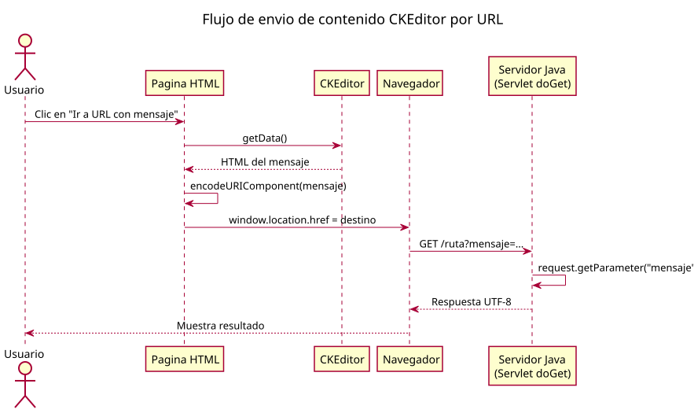

# Explicacion completa del trabajo realizado

## Objetivo principal

Se construyo una pagina HTML con Bootstrap 4 y un formulario con CKEditor para escribir contenido enriquecido y enviarlo por URL como parametro.

## Archivos implicados

- pagina.html
- EXPLICACION.md
- plantuml.jar
- plantuml-jre8.jar
- img/secuencia_ckeditor.puml
- img/secuencia_ckeditor.svg

## Tecnologias usadas

- Bootstrap 4.6 por CDN
- jQuery 3.5.1 slim por CDN
- Bootstrap Bundle 4.6 por CDN
- CKEditor 4.22.1 standard por CDN
- PlantUML para el diagrama de secuencia

## Cambios funcionales realizados en la pagina

1. Se creo el formulario con campos de nombre, correo, asunto y mensaje.
2. El campo mensaje se transformo a CKEditor con CKEDITOR.replace.
3. Se amplio el editor en ancho y altura.
4. Se redujo la toolbar para dejar solo Bold y Link.
5. Se oculto el pie de ruta de elementos del editor.
6. Se agrego boton para redireccionar a una URL con el contenido del editor como query param.

## Ajustes visuales de CKEditor

- Ancho al 100 por ciento sobre su contenedor.
- Altura alta para escritura amplia.
- Zoom de 125 por ciento solo con CSS.
- Fallback con transform para navegadores sin soporte de zoom.

## Configuracion de toolbar y pie del editor

- Toolbar limitada a negrita y enlace.
- removePlugins: elementspath para ocultar la ruta inferior tipo body p.
- resize_enabled: false para quitar la esquina de redimensionado.

## Envio de contenido por URL

El boton adicional hace este flujo:

1. Lee contenido con CKEDITOR.instances.mensaje.getData().
2. Codifica con encodeURIComponent.
3. Construye destino con ?mensaje=...
4. Redirige con window.location.href.

## Codificacion del parametro

Se envia como percent-encoding sobre UTF-8:

- Espacios como %20.
- Acentos, eñe y caracteres especiales convertidos a secuencias UTF-8 escapadas.

## Recuperacion en Servlet Java (GET, UTF-8)

Recuperacion normal:

- String mensaje = request.getParameter("mensaje");

Configuracion recomendada en Tomcat:

- URIEncoding="UTF-8"
- useBodyEncodingForURI="true"

Nota:

- request.setCharacterEncoding("UTF-8") ayuda sobre todo en cuerpo POST, no siempre en query GET.

## Diferencia entre getData y value

- CKEDITOR.instances.mensaje.getData() devuelve el HTML actual del editor.
- document.getElementById("mensaje").value devuelve el valor del textarea original.

Para sincronizar textarea antes de leer value:

- CKEDITOR.instances.mensaje.updateElement();

## Comandos Git explicados

- git remote -v
- git remote get-url origin

Remote detectado:

- origin -> https://github.com/aberbel/git.git

## Diagrama de secuencia en PlantUML

### Fuente PlantUML

El diagrama se dejo en:

- img/secuencia_ckeditor.puml

### Instalacion y ejecucion solicitada

Se dejo instalado plantuml.jar en la raiz del proyecto y no se elimino.

Comando intentado para generar SVG:

- java -jar .\plantuml.jar -tsvg .\img\secuencia_ckeditor.puml

Resultado:

- Error de version Java: el jar principal requiere runtime mas nuevo.

### Solucion aplicada sin quitar plantuml.jar

1. Se mantuvo plantuml.jar intacto en la raiz.
2. Se descargo un jar compatible con Java 8: plantuml-jre8.jar.
3. Se genero el SVG con:

- java -jar .\plantuml-jre8.jar -tsvg .\img\secuencia_ckeditor.puml

4. Se obtuvo correctamente:

- img/secuencia_ckeditor.svg

### Comandos para ejecutar PlantUML y obtener SVG

Con lo instalado en este proyecto, estos son los comandos recomendados en PowerShell:

1. Ir al directorio del proyecto:

- cd C:\Users\Casa\Desktop\gitdesa

2. Verificar Java:

- java -version

3. Generar SVG de un archivo .puml:

- java -jar .\plantuml-jre8.jar -tsvg .\img\secuencia_ckeditor.puml

4. Generar SVG de todos los .puml de la carpeta img:

- Get-ChildItem .\img\*.puml | ForEach-Object { java -jar .\plantuml-jre8.jar -tsvg $\_.FullName }

5. Generar en una carpeta de salida especifica:

- New-Item -ItemType Directory -Force .\img\svg
- java -jar .\plantuml-jre8.jar -tsvg -o .\img\svg .\img\secuencia_ckeditor.puml

Nota:

- Se conserva plantuml.jar en la raiz por peticion del usuario.
- Para generar en este entorno, se usa plantuml-jre8.jar por compatibilidad con Java 8.
- Pasos mínimos:

- Ir al proyecto
- Ejecutar PlantUML con formato SVG
- Comandos:

- cd C:\Users\Casa\Desktop\gitdesa
- java -jar plantuml-jre8.jar -tsvg secuencia_ckeditor.puml
- Eso te genera el SVG junto al .puml, en secuencia_ckeditor.svg.

### Vista del diagrama en Markdown

GitHub no renderiza PlantUML de forma nativa, por eso se incluye el SVG generado:

## Estado final

El proyecto queda con:

- Formulario funcional con CKEditor.
- Toolbar minima (Bold y Link).
- Pie de CKEditor oculto.
- Zoom visual aplicado al editor.
- Redireccion con parametro mensaje codificado en UTF-8 para uso en backend Java.
- Diagrama de secuencia en PlantUML y su SVG listo para visualizar en GitHub.
